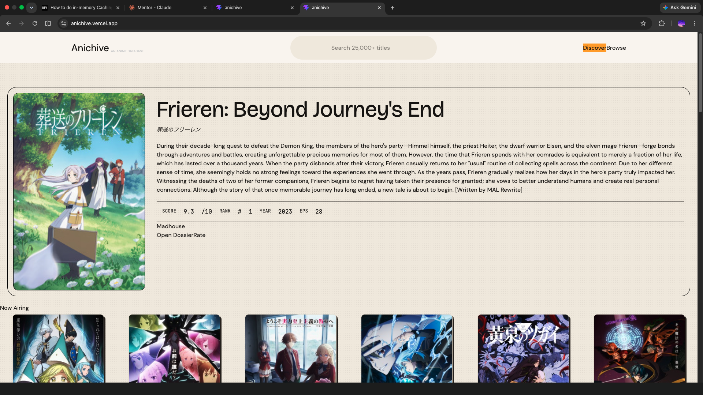

# Anichive: Anime Database

A responsive anime search and discovery app, built with vanilla React and Vite.

🔗 **Live demo:** https://anichive.vercel.app/



## What this project demonstrates

- Async data fetching with race-condition handling (AbortController cleanup)
- Module-scope in-memory caching to deal with remount-refetches and burst loads
- Request throttling via staggered debouncing to respect API rate limits
- Custom `useFetch` hook: handles AbortController cleanup, in-memory caching by URL, and configurable debounce
- Component-level lazy loading with IntersectionObserver

## The problem I solved: 429 rate limiting

The most interesting problem I solved was eliminating 429 rate-limit errors during page load. On initial load, ~25% of cold loads hit 429 errors, with different fetches failing each time. Diagnosis: four parallel fetches were firing within ~10ms of each other on mount. Jikan's free tier allows 3 requests per second; the 4th was rate-limited unpredictably.

After ruling out heavier solutions like a backend cache or pre-populated database, I went with this approach:

1. Built a module-scope `Map` cache keyed by URL to eliminate refetches on view-switch. This fixed remount-refetches but didn't address cold loads.
2. Hypothesized the four fetches needed temporal spacing. Added staggered debounce delays per component (0ms, 800ms, 1600ms, 2400ms).
3. Initial diagnostic logs appeared to show timers firing instantly. Realized the log itself was misplaced (logging schedule time, not fire time). Moved the log into the setTimeout callback.
4. Re-tested with the corrected diagnostic. Confirmed timers were firing at correct intervals; the network tab showed clean staggering of ~800ms between requests.

**Result:** zero 429 errors across 10 cold-load tests in production build. Each request lands in its own one-second window.

## Stack

React, Vite, Tailwind, Jikan API. Deployed on Vercel.

## Local setup

```bash
git clone <repo-url>
cd anichive
npm install
npm run dev
```

## Planned for v2

- Full mobile and tablet responsiveness (current build is desktop-focused)
- TypeScript port
- Genre, type, and rating browse modes
- Performance optimization (skeleton loaders, image lazy loading)

## What I learned

The biggest lesson from this project was about reusability and planning. I used Claude as a design tool to mock up the UI, which let me see it visually but masked a real shortfall: I didn't plan for component reusability before designing. The first build had duplicated fetch logic across multiple sections. The refactor — extracting `useFetch` as a custom hook and consolidating list-rendering logic — taught me to plan for reuse upfront rather than refactor after the fact. Going forward I'll do noun/verb decomposition before writing components, not after.

## Expanding the ESLint configuration

If you are developing a production application, we recommend using TypeScript with type-aware lint rules enabled. Check out the [TS template](https://github.com/vitejs/vite/tree/main/packages/create-vite/template-react-ts) for information on how to integrate TypeScript and [`typescript-eslint`](https://typescript-eslint.io) in your project.
